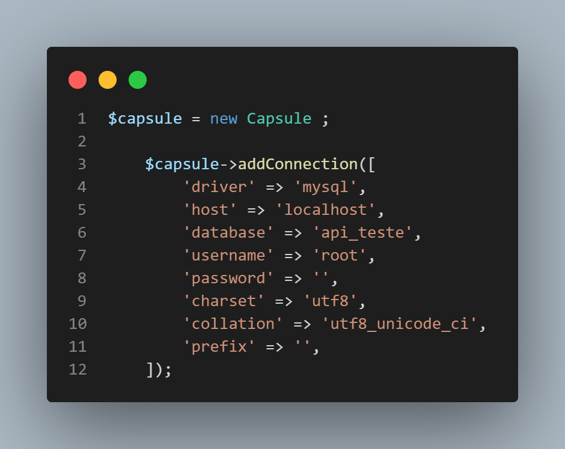

# Api-slim-php

# tecnologias: PHP, Slim Framework, Composer, Illuminate

## Documentação

1 - criar um database em seu geranciador de banco de dados.
2 - alterar os parametros dentro do arquivo index, a partir da linha 25.

2 - Rodar a Api e ultilizar o diretorio '/createBD' q para criar uma tabela teste em seu banco de dados.

## comandos

* /      (recupera todos os arquivos)
* /id    (recupera apenas o registro do id correspondente)
* /post  (para envio de dados)
* /delete/id  (deletando registro correspondete ao id)
* /put/id  (atualizando registro correspondete ao id)
